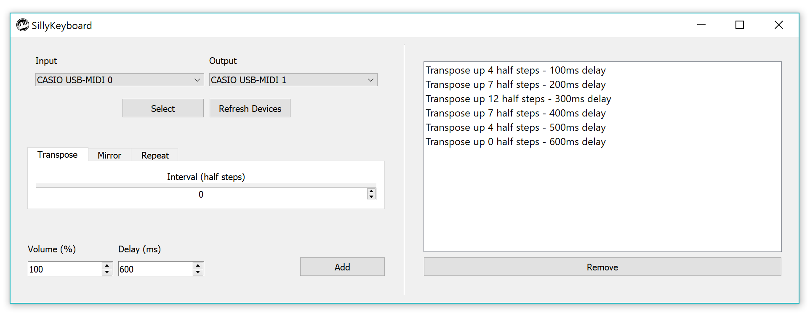

# SillyKeyboard

Generate music interactively with any MIDI keyboard.





## Setup

If you're running WIndows, just run the latest release build. It's unsigned so Windows may try to block it, but I promise it's safe! If you're on Linux or MacOS, or you feel like playing around with the source code, just clone this repository and run ```python sillykeyboard.py```.


Connect a MIDI keyboard to your computer with a USB cable and you're good to go!


## Requirements

The following are required unless you are running the Windows release:

* Python 3.6+
* mido
* PyQt5
* python-rtmidi
